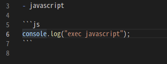
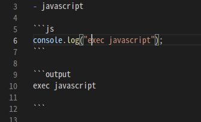

# Rodem

babel-like extension in Markdown(.md)

## Features

### execute code in Markdown

write code

Press `F5` or `Ctrl-P -> Rodem: execute code` to execute

## default laungage

- javascript(js)
- ruby(rb)
- bash(sh)
- python(py)

## Requirements

none

## Extension Settings

if you would like to add language to this extension, edit `rodem.lang` in `settings.json`.

## Release Notes

### 0.1

Initial release of Rodem

